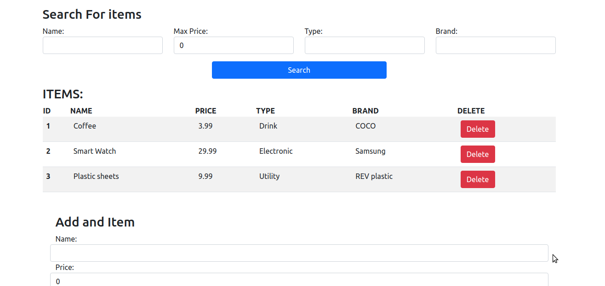

# Simple Inventory management React js app

#### Based On Tech With Tim React tutorial

### Features:

- Add Items with their properties.
- Store the data on a JSON-server backend.
- Search for curtain item using its properties.

**Screenshot from the app:**

### What I learned:

1. How React JS components works.
2. Hooks and their usage(useState/useEffect).
3. API calls with different methods(GET/POST/DELETE).

4. Filter incoming data according to search parameters.

---

### How to start the app:

1. Clone The repository `git clone $THIS-REPO-URL`
2. Navigate to the repo directory and run `npm install`
3. Run `json-server db.json` to run the JSON backend server.
4. Run `npm start` to start development server and start using the app.
